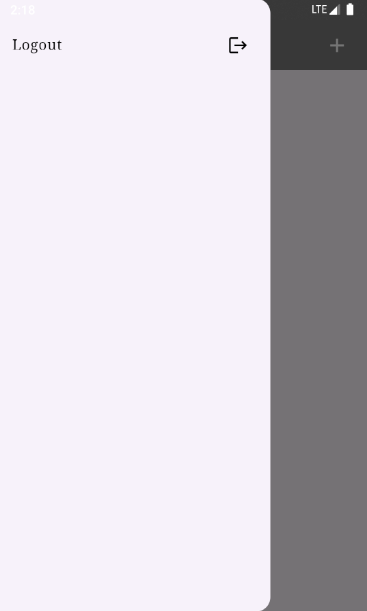

# H1D022055_responsi1

Responsi 1 Praktikum Pemrograman Mobile.

## SS Aplikasi

1. Halaman Login
- Halaman login data terisi

- Halaman login data belum diisi

- Halaman login gagal

3. Halaman Registrasi
- Halaman Registrasi data terisi

- Halaman Registrasi data belum terisi

- Halaman Registrasi berhasil

4. Halaman Guide Page
- Halaman guide page awal

- Halaman guide page setelah proses tambah data

- Halaman guide page setelah proses update data

- Halaman guide page setelah proses hapus data

5. Halaman Tambah Guide
- Halaman tambah guide data diisi

- Halaman tambah guide data belum diisi

- Halaman tambah guide gagal

6. Halaman Detail Guide
- Halaman detail guide

- Tampilan validasi proses hapus data guide

7. Halaman Edit Guide
- Halaman edit guide data terisi

- Halaman edit guide data belum diisi

8. Menubar + Logout

